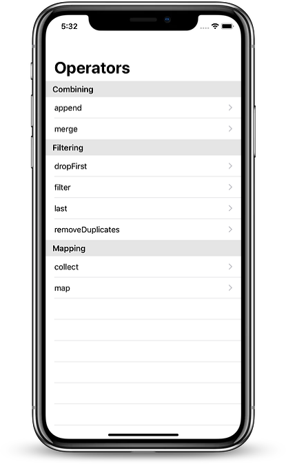
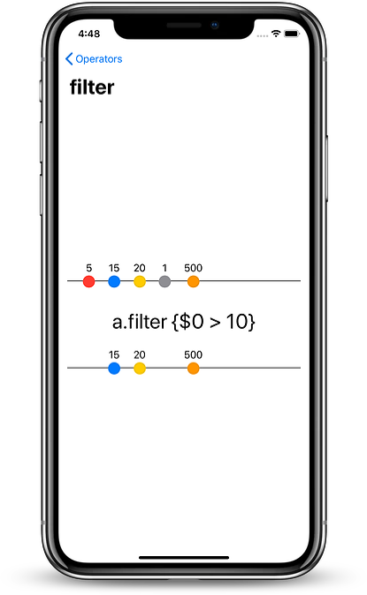

# CombineMarbles for iOS

Diagrams of Combine Publishers implemented with SwiftUI

Combine is a new library for composing asynchronous events over time (Rx-Like).

## TODO:
- [ ] Implement all operators available
- [ ] Interactive Diagrams
- [ ] Description of the operator in the detail view
- [ ] Catalyst

and many more!

## Contributors

I'd like to thanks these people for their contributions  
@florianmari
